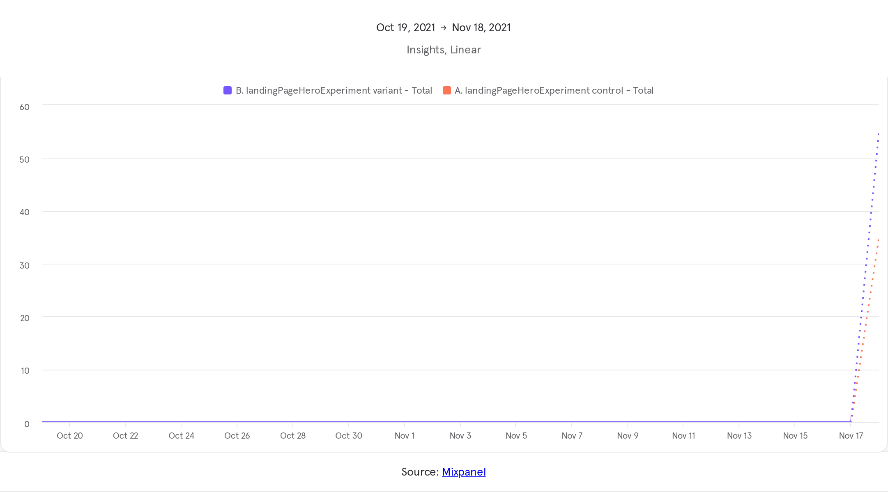
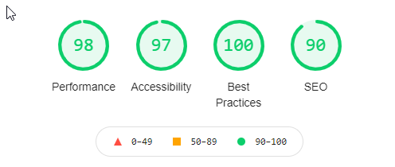

# React Challenge #001

Implemented a landing page for Hapu Nanny Share.

You can access a live version of this landing page at: https://hapunannyshare.netlify.app/

The current build is being part of a A/B test. The test is testing out which Hero section text is presenting better to the user.
To do the A/B test we are using a A/B Testing React Component which can be found at https://www.npmjs.com/package/@marvelapp/react-ab-test
To see the reports on the A/B test I decided to use MixPanel which has a free tier. You can access the testing report at https://mixpanel.com/s/20Syl5
Note you will have to login and ask for permission to see the report.
Below is a sample of the report:

## How to run the app in development mode

- git clone https://github.com/robergwillian/hapu.git
- run `yarn` to download
- once dependencies are downloaded you should run `yarn start` to start the development server.
- Open [http://localhost:3000](http://localhost:3000) to view it in the browser.

## How to create production build

- after you have finished in development mode you should run `yarn build` 
- This will bundle, minify all files and filenames, and optimizes the build for best performance
- Builds the app for production to the `build` folder.\
- Your app is ready to be deployed!

### Lighthouse performance report

- This is the lighthouse report of the landing page as is in this repo:

